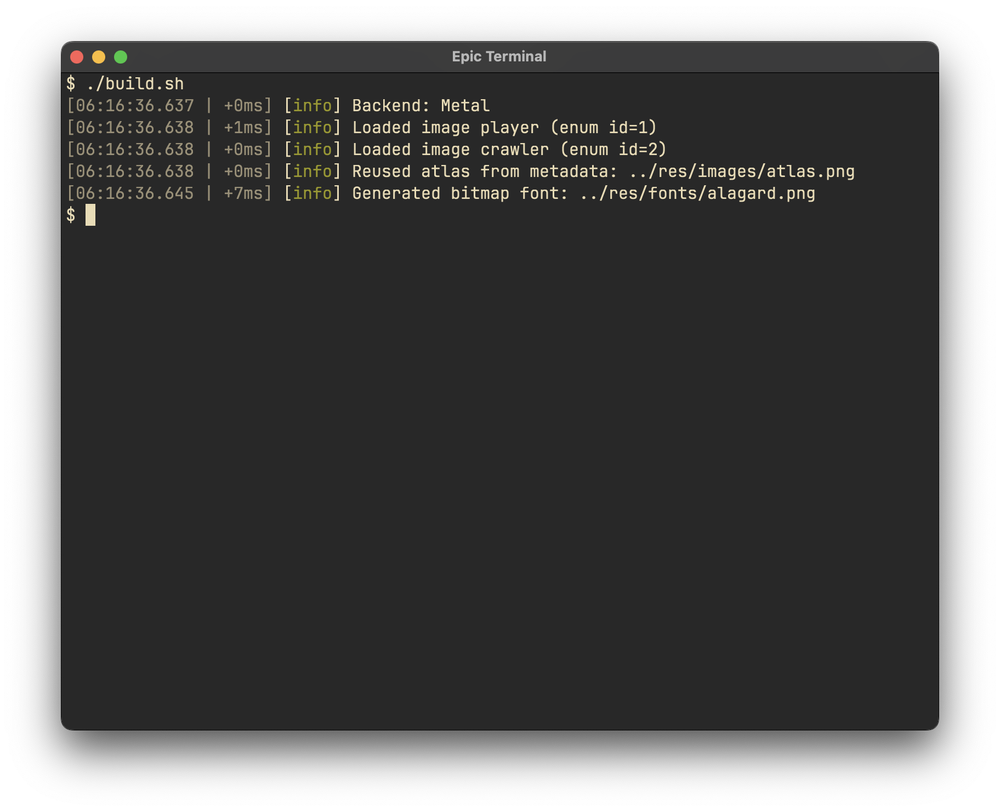

# Asura Engine

<table>
  <tr>
    <td>
      
    </td>
    <td>
      A <strong>Team Sigma</strong> Project
    </td>
  </tr>
</table>


Asura is a C++ engine/framework for game development. It’s currently being used in two WIP projects, and I plan to open-source them once completed.

Asura does not handle windowing and context creation. Instead, it leans on [sokol](https://github.com/floooh/sokol) for cross-platform graphics (Metal on macOS, D3D11 on Windows, and OpenGL on Linux), making it effectively just a renderer/wrapper over sokol.

This is similar to another one of my projects, [SmallGraphicsLayer](https://github.com/shreejitmurthy/SmallGraphicsLayer). SGL is on indefinite pause (commits are scant), but it is a useful reference for Asura since it uses sokol and contains some design principles that reflect in Asura.

## Dependencies
Asura requires a few dependencies:
- [sokol](https://github.com/floooh/sokol): Cross-platform graphics abstraction.
- [spdlog](https://github.com/gabime/spdlog): Fast console logging.
- [json](https://github.com/nlohmann/json): Used in asset metadata creation for faster game reloads.

## Features
### Basic Debug Text Rendering
```cpp
#include <asura/asura.h>

void draw() {
    Asura::begin(pass_action);

    Asura::Debug::print("Hello, World!", {red, green, blue});
    Asura::Debug::print(std::format("FPS: {}", std::round(1 / delta_time)));

    Asura::end();
}
```
### "Registry" Based Asset Loading
```cpp
#include <asura/asura.h>

Asura::SpriteRenderer sr;
Asura::FontRenderer fr;

enum class SpriteID : uint8_t {
    Player = 1,
    Enemy
};

static const std::vector<Asura::ResourceDef> spriteRegistry = {
    // string names must match the filename: player.png, enemy.png, ...
    { "player", (int)SpriteID::Player },
    { "enemy",  (int)SpriteID::Enemy },
};

enum class FontID : uint8_t {
    Alagard = 1,
};

static const std::vector<Asura::ResourceDef> fontRegistry = {
    // string name, ID, font size
    {"alagard", (int)FontID::Alagard, 16}
};

void init() {
    Asura::init();

    sr.init("res/images/", spriteRegistry);
    
    fr.init("res/fonts/", fontRegistry);
}
```
### GPU Instanced Sprite Renderer
Arguments for the `push()` function are: `E id, vec2 position, vec2 scale = {1, 1}, float rotation = 0.f, sg_color tint = sg_white, vec2 pivot = Asura::Pivot::TopLeft(), vec2 pivot_px = {0, 0}`
```cpp
#include <asura/asura.h>

void draw() {
    Asura::begin(pass_action);

    sr.push(SpriteID::Player, {100, 100});

    sr.push(SpriteID::Enemy,  {400, 500}, {2, 2}, program_runtime, Asura::Pivot::Centre());

    sr.render();

    Asura::end();
}
```
### Bitmap Font Rendering
Arguments for the `queue()` function are: `E id, std::string_view text, glm::vec2 pos, float scale = 1.f, sg_color tint = sg_white`
```cpp
#include <asura/asura.h>

void draw() {
    Asura::begin(pass_action);

    fr.queue(FontID::Alagard, "very epic code", {250, 250}, 2);

    fr.render();

    Asura::end();
}
```
### Informative Logging
<p align="center">
    
</p>

### Basic Math Functions
Asura's math headers contain only what's necessary for Asura to run, minimal bloat.
```cpp
#include <asura/math.hh>
using namespace Asura::Math;

Vec2 a{1.f, 2.f}, b{4.f, 6.f};
Vec2 dir2 = (b - a).normalized();               // safe normalize (eps)
Vec2 n2   = dir2.perp();                        // 90 CCW normal (2D)
Vec2 ease = Vec2::lerp(a, b, 0.25f);            // smooth-ish stepping
float d2  = a.dot(b), len2 = (b - a).length2();

iVec2 A{0, 0}, B{1920, 1080};
Vec2  midPx = iVec2::lerp(A, B, 0.5f);          // int grid -> float result

Vec3 up{0.f, 1.f, 0.f}, fwd{0.f, 0.f, -1.f};
Vec3 right = up.cross(fwd).normalized();        // orthonormal axis

Mat4 M = Mat4::translate({2.f, 0.f, 0.f}) * Mat4::rotateY(0.5f) * Mat4::scale({2.f, 1.f, 2.f});
Vec3 worldP = M.multiplyPoint({1.f, 2.f, 3.f});  // includes translation + perspective divide

Mat4 P = Mat4::orthoCentered(800.f, 600.f, 0.1f, 100.f, true);
float yScale = P(1, 1);                          // direct element access (row, col)
```

## TODO
- [x] Use custom math header
- [x] Safe directory parsing.
- [ ] Image doesn't stretch after resizing window.
- [ ] Primitives (basic lines and shapes) for debugging
- [ ] ImGui support
- [ ] Async asset loading

